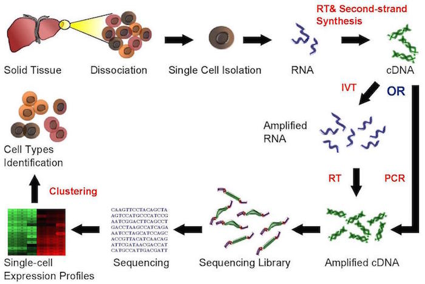
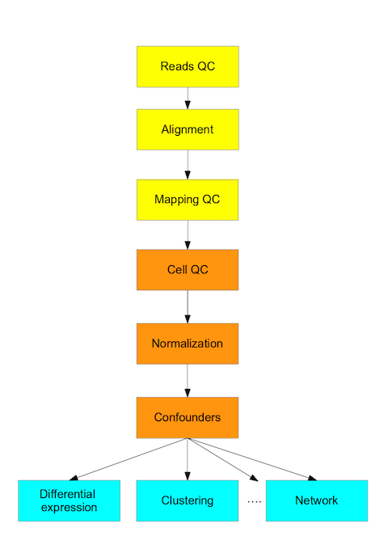

# Introduction to single-cell RNA-seq

```{r, echo=FALSE}
library(knitr)
opts_chunk$set(fig.align = "center", echo=FALSE)
```

## Bulk RNA-seq

* A major breakthrough (replaced microarrays) in the late 00's and has been widely used since
* Measures the __average expression level__ for each gene across a large population of input cells
* Useful for comparative transcriptomics, e.g. samples of the same tissue from different species
* Useful for quantifying expression signatures from ensembles, e.g. in disease studies
* __Insufficient__ for studying heterogeneous systems, e.g. early development studies, complex tissues (brain)
* Does __not__ provide insights into the stochastic nature of gene expression
    
## scRNA-seq

* A __new__ technology, first publication by [@Tang2009-bu]
* Did not gain widespread popularity until [~2014](https://www.ohio.edu/bioinformatics/upload/Single-Cell-RNA-seq-Method-of-the-Year-2013.pdf) when new protocols and lower sequencing costs made it more accessible
* Measures the __distribution of expression levels__ for each gene across a population of cells
* Allows to study new biological questions in which __cell-specific changes in transcriptome are important__, e.g. cell type identification, heterogeneity of cell responses, stochasticity of gene expression, inference of gene regulatory networks across the cells.
* Datasets range __from $10^2$ to $10^5$ cells__ and increase in size every year
* Currently there are several different protocols in use, e.g. SMART-seq2 [@Picelli2013-sb], CELL-seq [@Hashimshony2012-kd] and Drop-seq [@Macosko2015-ix]
* Several computational analysis methods from bulk RNA-seq __can__ be used
* __In most cases__ computational analysis requires adaptation of the existing methods or development of new ones

## Protocol

```{r intro-rna-seq-workflow, out.width = '90%', fig.cap="Single cell sequencing (taken from Wikipedia)"}

```

Overall, experimental scRNA-seq protocols are similar to the methods used for bulk RNA-seq. For a discussion on experimental methods, please see reviews by [@Saliba2014-dy], [@Handley2015-yi] or [@Kolodziejczyk2015-xy].

## Computational Analysis

This course is concerned with the computational analysis of the data
obtained from scRNA-seq experiments. The first steps (yellow) are general for any highthroughput sequencing data. Later steps (orange) require a mix of existing RNASeq analysis methods and novel methods to address the technical difference of scRNASeq. Finally the biological interpretation __should__ be analyzed with methods specifically developed for scRNASeq.

```{r intro-flowchart, out.width = '65%', fig.cap="Flowchart of the scRNA-seq analysis"}

```

There are several reviews of the scRNA-seq analysis available including [@Stegle2015-uv].

## Challenges

The main difference between bulk and single cell RNA-seq is that each sequencing library represents a single cell, instead of a population of cells. Therefore, significant attention has to be paid to comparison of the results from different cells (sequencing libraries). The main sources of discrepancy between the libraries are:

* __Amplification__ (up to 1 million fold)
* __Gene 'dropouts'__ in which a gene is observed at a moderate expression level in one cell but is not detected in another cell [@Kharchenko2014-ts].

In both cases the discrepancies are introduced due to low starting amounts of transcripts since the RNA comes from one cell only. Improving the transcript capture efficiency and reducing the amplification bias are currently active areas of research.

## Controls

To provide better estimates of the technical variation between scRNA sequencing libraries two quantitative standards are frequently used. The aim of using spike-ins and UMIs is to facilitate normalization of gene expression levels across different cells.

### Spike-ins

Spike-ins are extrinsic RNA molecules of known concentration which are added to the lysate of each cell prior to the reverse transcription reaction. The most popular and widely used spike-ins are synthetic spikes from the [External RNA Control Consortium (ERCC)](https://www.thermofisher.com/order/catalog/product/4456740). This set of 96 synthetic mRNAs of differing length and GC content based on bacterial sequences [@Jiang2011-mu].

### UMIs

Another method of standardisation is to use Unique Molecular Identifiers (UMIs) [@Kivioja2012-yt]. These are 4-20 bp barcode sequences which are added to the 3' or 5' end of each transcript prior to amplification (typically during reverse transcription). This is usually followed by targetted sequencing of the respective end of the transcripts. The barcodes make it possible to quantify the number of transcripts prior to the amplification step.
