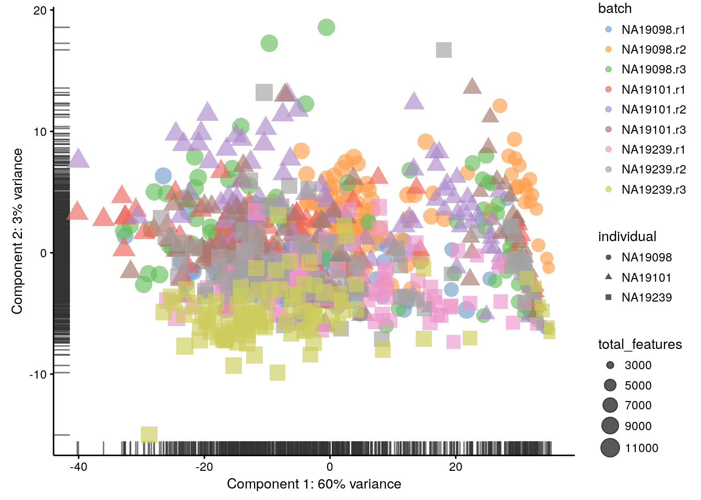
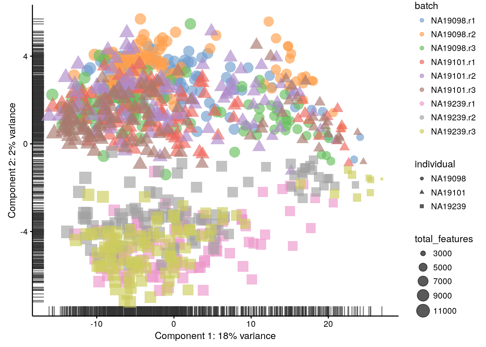
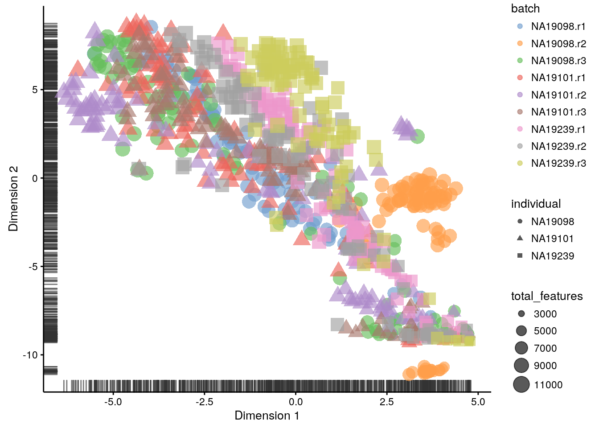
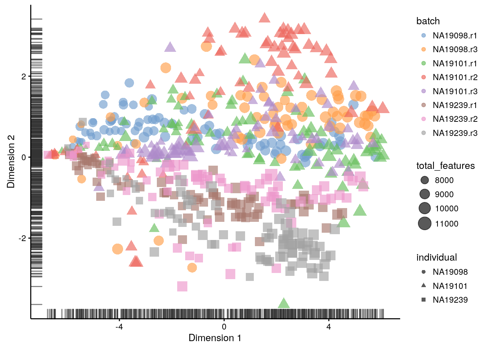
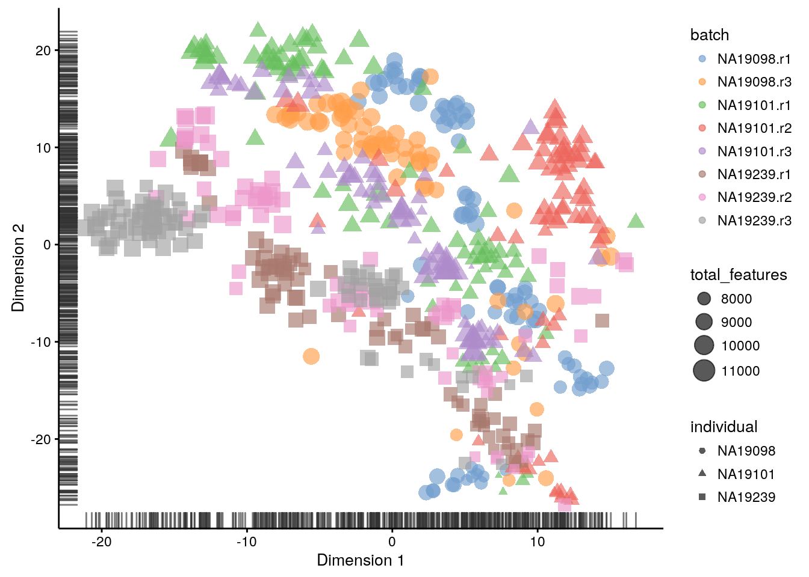
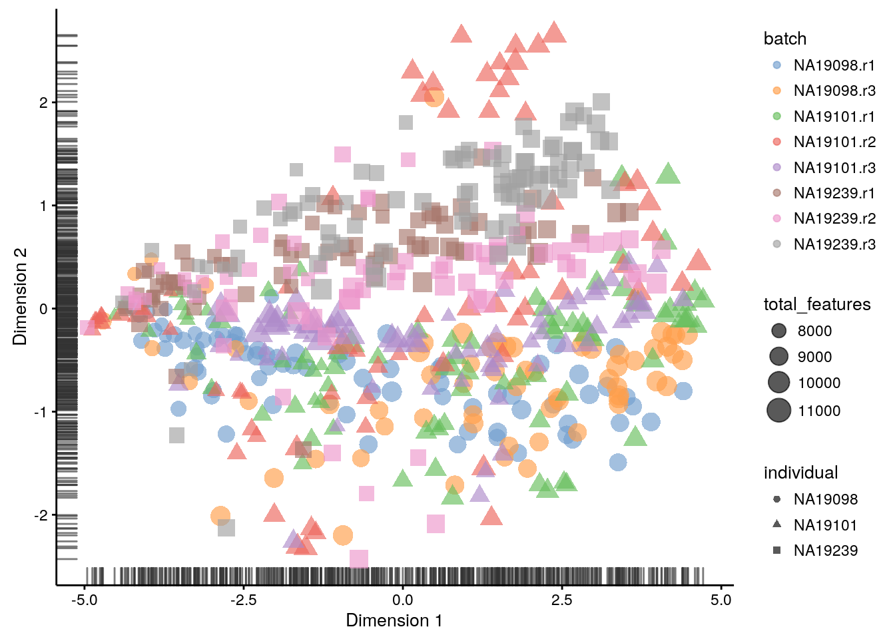

# Data visualization (Reads)


```r
library(scater, quietly = TRUE)
options(stringsAsFactors = FALSE)
reads <- readRDS("tung/reads.rds")
reads.qc <- reads[fData(reads)$use, pData(reads)$use]
endog_genes <- !fData(reads.qc)$is_feature_control
```


```r
scater::plotPCA(reads[endog_genes, ],
                ntop = 500,
                colour_by = "batch",
                size_by = "total_features",
                shape_by = "individual",
                exprs_values = "counts")
```

<div class="figure" style="text-align: center">

<p class="caption">(\#fig:expr-overview-pca-before-qc-reads1)PCA plot of the tung data</p>
</div>


```r
scater::plotPCA(reads[endog_genes, ],
                ntop = 500,
                colour_by = "batch",
                size_by = "total_features",
                shape_by = "individual",
                exprs_values = "log2_counts")
```

<div class="figure" style="text-align: center">

<p class="caption">(\#fig:expr-overview-pca-before-qc-reads2)PCA plot of the tung data</p>
</div>


```r
scater::plotPCA(reads.qc[endog_genes, ],
                ntop = 500,
                colour_by = "batch",
                size_by = "total_features",
                shape_by = "individual",
                exprs_values = "log2_counts")
```

<div class="figure" style="text-align: center">

<p class="caption">(\#fig:expr-overview-pca-after-qc-reads)PCA plot of the tung data</p>
</div>


```r
scater::plotTSNE(reads[endog_genes, ],
                 ntop = 500,
                 perplexity = 130,
                 colour_by = "batch",
                 size_by = "total_features",
                 shape_by = "individual",
                 exprs_values = "log2_counts",
                 rand_seed = 123456)
```

<div class="figure" style="text-align: center">

<p class="caption">(\#fig:expr-overview-tsne-before-qc-reads)tSNE map of the tung data</p>
</div>


```r
scater::plotTSNE(reads.qc[endog_genes, ],
                 ntop = 500,
                 perplexity = 130,
                 colour_by = "batch",
                 size_by = "total_features",
                 shape_by = "individual",
                 exprs_values = "log2_counts",
                 rand_seed = 123456)
```

<div class="figure" style="text-align: center">

<p class="caption">(\#fig:expr-overview-tsne-after-qc-reads)tSNE map of the tung data</p>
</div>

<div class="figure" style="text-align: center">

<p class="caption">(\#fig:expr-overview-tsne-after-qc-exercise2-1)tSNE map of the tung data (perplexity = 10)</p>
</div>

<div class="figure" style="text-align: center">

<p class="caption">(\#fig:expr-overview-tsne-after-qc-exercise2-2)tSNE map of the tung data (perplexity = 200)</p>
</div>
