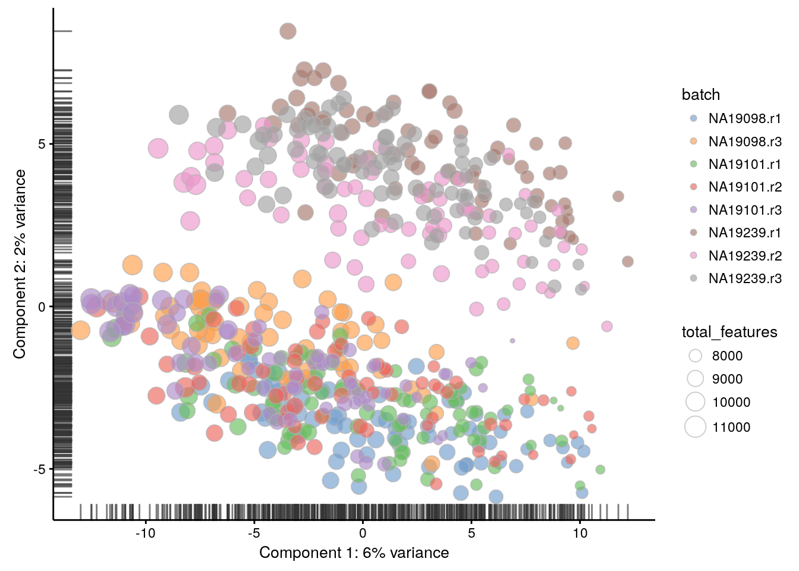
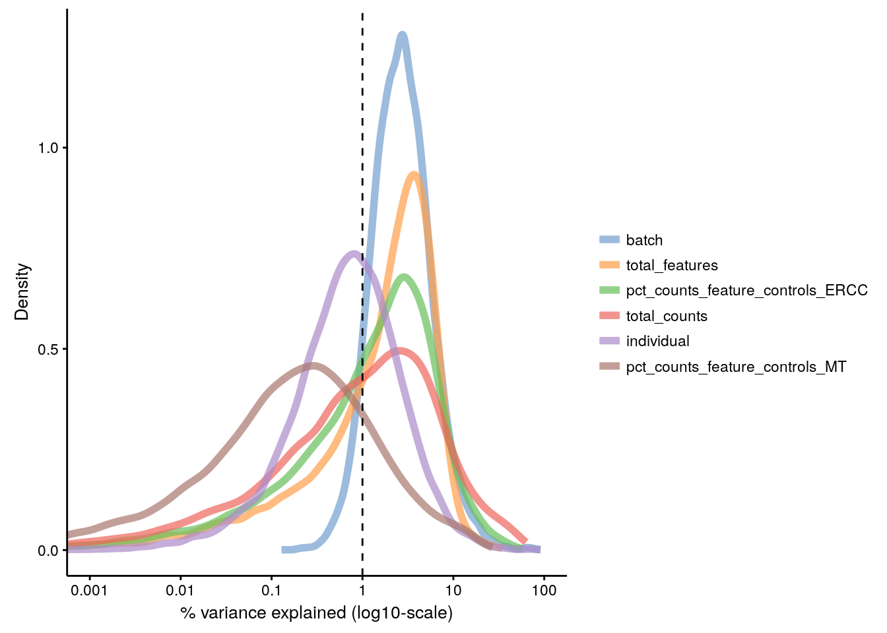

# Identifying confounding factors (Reads)

(\#fig:confound-pca-reads)PCA plot of the tung data

(\#fig:confound-find-pcs-total-features-reads)PC correlation with the number of detected genes

(\#fig:confound-find-expl-vars-reads)Explanatory variables

