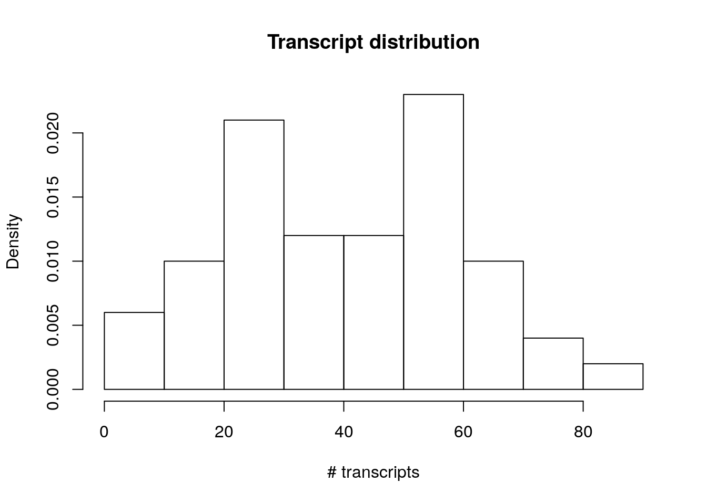
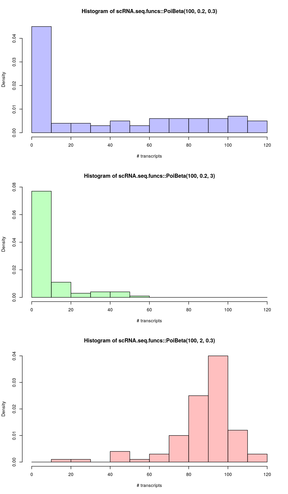
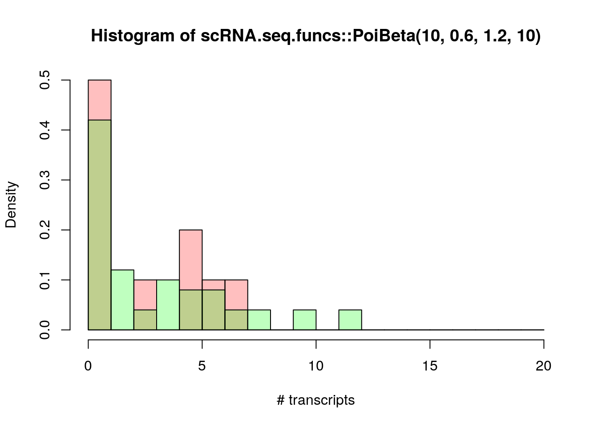
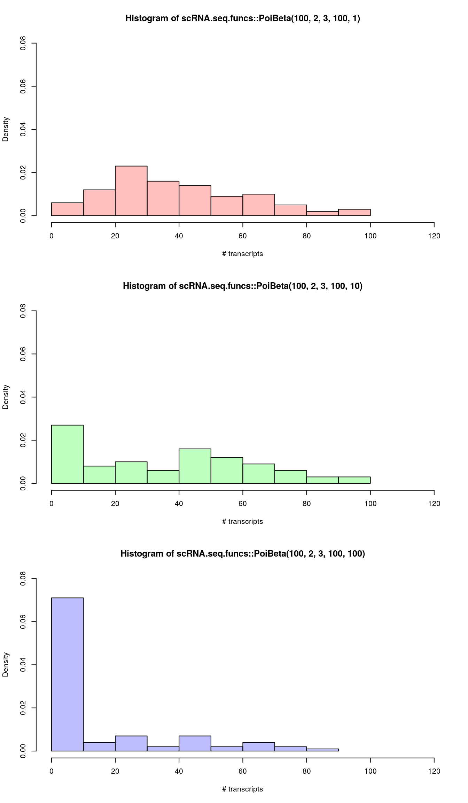
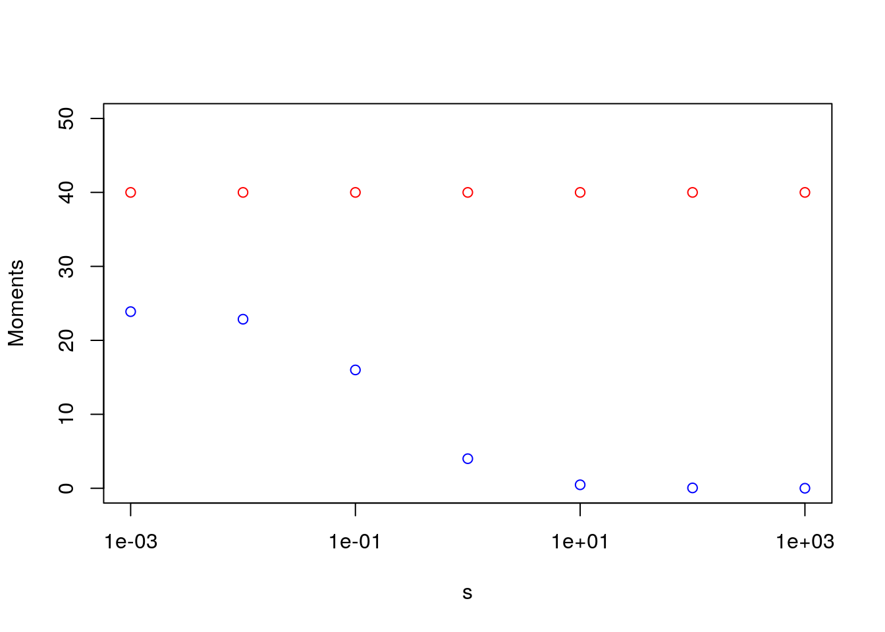
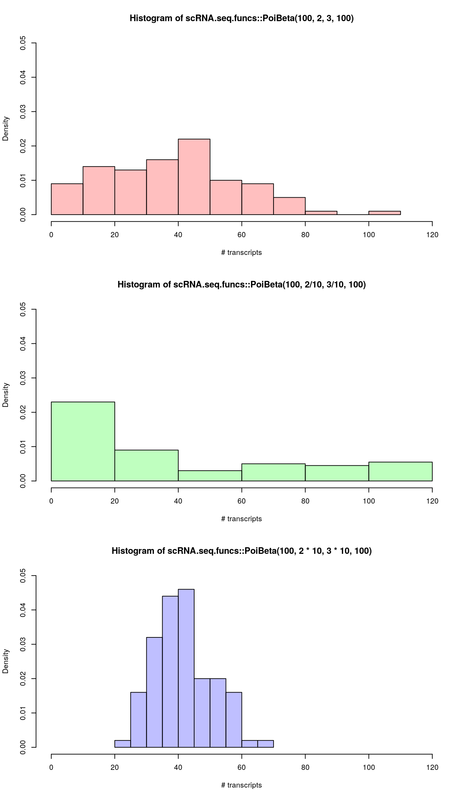

# Differential Expression (DE) analysis


## Bulk RNA-seq

One of the most common types of analyses when analyzing bulk RNA-seq
data is to identify differentially expressed genes. By comparing the
genes that change between two conditions, e.g. mutant and wild-type or
stimulated and unstimulated, it is possible to characterize the
molecular mechanisms underlying the change.

Several different methods,
e.g. [DESeq2](https://bioconductor.org/packages/DESeq2) and
[edgeR](https://bioconductor.org/packages/release/bioc/html/edgeR.html),
have been developed for bulk RNA-seq. Moreover, there are also
extensive
[datasets](http://genomebiology.biomedcentral.com/articles/10.1186/gb-2013-14-9-r95)
available where the RNA-seq data has been validated using
RT-qPCR. These data can be used to benchmark DE finding algorithms. 

## Single cell RNA-seq

In contrast to the bulk RNA-seq in scRNA-seq we usually do not have a defined
set of experimental conditions, but instead, as was shown in the previous chapter
(\@ref(clust-methods)) we can identify the cell groups by using the unsupervised
clustering approach. Once the groups have been identified one can find differentially
expressed genes by either looking at the differencies in variance between the groups (like the Kruskal-Wallis test implemented in SC3), or by comparing gene expression between clusters in a pairwise manner. In the following chapter we will mainly consider tools developed for the comparison of the two groups of cells.

## scRNA-seq synthetic data

One advantage of working with single-cell data is
that there is a reliable, analytically tractable mathematical model for
the expression levels, the Poisson-Beta distribution. Importantly, the
Poisson-Beta distribution has strong experimental support, and it
provides a good fit to scRNA-seq data.

In this module, we first discuss the Poisson-Beta distribution. We
then use the model to generate synthetic data which we can use to
compare different DE finding algorithms. In the final section we
investigate a real scRNA-seq dataset.

## Single gene expression


```r
library(scRNA.seq.funcs)
set.seed(1)
```

For single-cell data, the analytically tractable stochastic bursting
model provides a good fit. Thus, we can use it to generate realistic
data. We start by generating samples from one gene:

```r
s <- scRNA.seq.funcs::PoiBeta(100, 2, 3)
```

We then plot the results as a histogram:

```r
hist(s,
     freq = FALSE,
     xlab = "# transcripts",
     main = "Transcript distribution")
```

<div class="figure" style="text-align: center">

<p class="caption">(\#fig:poisson-beta-plot)Distribution of read counts for a single genes across 100 cells based on the Poisson-Beta model</p>
</div>

The probability mass function of the Poisson-Beta distribution is
challenging to work with since it involves special functions. However,
the mean and variance can be calculated as:

$\mu = k\cdot a/(a+b)$

$\sigma^2 = k^2\cdot a\cdot b/((a+b+1)\cdot(a+b)^2)$

## Poisson-Beta distribution

There are three regimes of the Poisson-Beta distribution and they are
determined by the values of the parameters $a$ and $b$.

When $a<1$ and $b<1$ we have a bimodal distribution with one mode at 0 and
the other at $k$, when $a<1$ and $b>1$ we have a monotonically decreasing
distribution and otherwise we have a unimodal distribution with a mode
at $ka/(a+b)$.


```r
par(mfrow=c(3,1))
hist(scRNA.seq.funcs::PoiBeta(100, .2, .3),
     freq = FALSE,
     xlab = "# transcripts",
     col = rgb(0, 0, 1, 1/4),
     breaks = seq(0, 120, 10))
hist(scRNA.seq.funcs::PoiBeta(100, .2, 3),
     freq = FALSE,
     xlab = "# transcripts",
     col = rgb(0,1,0,1/4),
     breaks = seq(0, 120, 10))
hist(scRNA.seq.funcs::PoiBeta(100, 2, .3),
     freq = FALSE,
     xlab = "# transcripts",
     col = rgb(1, 0, 0, 1/4),
     breaks = seq(0, 120, 10))
```

<div class="figure" style="text-align: center">

<p class="caption">(\#fig:poisson-beta-shapes)Different distributions of read counts for a single genes across 100 cells based on the Poisson-Beta model corresponding to different paramete sets</p>
</div>

__Exercise 1__: Vary the parameters _a_, _b_ and _k_ to explore how the
location and shape of the distribution changes.

## Sample size

The difficulty in determining the parameters of the distribution also
depends on the sample size. In the example below, it is not clear if
the distribution is bimodal when only 10 samples are drawn.


```r
hist(scRNA.seq.funcs::PoiBeta(10, .6, 1.2, 10),
     freq = FALSE,
     xlab = "# transcripts",
     col = rgb(1, 0, 0, 1/4),
     breaks = seq(0, 20, 1))
hist(scRNA.seq.funcs::PoiBeta(10, .6, 1.2, 50),
     freq = FALSE,
     xlab = "# transcripts",
     col = rgb(0, 1, 0, 1/4),
     breaks = seq(0, 20, 1),
     add = TRUE)
```

<div class="figure" style="text-align: center">

<p class="caption">(\#fig:poisson-beta-sample-size)Effect of sampling size on the distribution of read counts based on the Poisson-Beta model</p>
</div>

__Exercise 2__: Modify the number of samples (i.e. cells) drawn to
explore how difficult it is to correctly infer the correct shape.

## Dropout noise

The stochastic bursting model only captures the biological
variability. In practice there will also be experimental
variability. We model the noise as drop-outs, i.e. we assume that
there is a small probality that each transcript is lost. For gene $i$
and cell $j$ it is assumed that the probability of loosing the
transcript is given by $p_d = \mu/(d+\mu)$, where $\mu$ is
the mean expression level of the gene and $d$ is a drop-out
parameter. Thus, the probability of drop-outs monotonically decreases
as the mean expression level increases.

To visualize the impact of the drop-outs on a sample, we can tune the
drop-out parameter:


```r
par(mfrow=c(3,1))
hist(scRNA.seq.funcs::PoiBeta(100, 2, 3, 100, 1),
     freq = FALSE,
     xlab = "# transcripts",
     col = rgb(1, 0, 0, 1/4),
     ylim = c(0, .08),
     xlim = c(0, 120))
hist(scRNA.seq.funcs::PoiBeta(100, 2, 3, 100, 10),
     freq = FALSE,
     xlab = "# transcripts",
     col = rgb(0, 1, 0, 1/4),
     ylim = c(0, .08),
     xlim = c(0, 120))
hist(scRNA.seq.funcs::PoiBeta(100, 2, 3, 100, 100),
     freq = FALSE,
     xlab = "# transcripts",
     col = rgb(0, 0, 1, 1/4),
     ylim = c(0, .08),
     xlim = c(0, 120))
```

<div class="figure" style="text-align: center">

<p class="caption">(\#fig:poisson-beta-dropout-example)Effect of dropouts on the distribution of read counts based on the Poisson-Beta model</p>
</div>

__Exercise 3__: Explore the different parameter regimes for the same
drop-out rate. Do you think that we are more sensitive to drop-outs in
any specific regime?

## Dispersion noise

Another example of noise is under- or over-dispersion. This can be
modelled using a single parameter multiplying the parameters $a$ and $b$
in the Poisson-Beta distribution by a scalar $s$. We can see that the
mean is left unchanged while the variance is inversely proportional to $s$.


```r
s <- 10^(-3:3)
k <- 100
a <- 2
b <- 3
par(mfrow=c(1,1))
plot(s,
     k*a*s/(a*s + b*s),
     log = "x",
     col = "red",
     ylim = c(0, 50),
     ylab = "Moments")
points(s,
       k*a*s*b*s/((a*s + b*s)^2*(a*s + b*s + 1)),
       col = "blue")
```

<div class="figure" style="text-align: center">

<p class="caption">(\#fig:poisson-beta-dispersion-analytical)The mean and the variance of the distribution of read counts based on the Poisson-Beta model</p>
</div>

To illustrate the effect of the dispersion parameter on the distribution consider:


```r
par(mfrow=c(3,1))
hist(scRNA.seq.funcs::PoiBeta(100, 2, 3, 100),
     freq = FALSE,
     xlab = "# transcripts",
     col = rgb(1, 0, 0, 1/4),
     ylim = c(0, .05),
     xlim = c(0, 120))
hist(scRNA.seq.funcs::PoiBeta(100, 2/10, 3/10, 100),
     freq = FALSE,
     xlab = "# transcripts",
     col = rgb(0, 1, 0, 1/4),
     ylim = c(0, .05),
     xlim = c(0, 120))
hist(scRNA.seq.funcs::PoiBeta(100, 2*10, 3*10, 100),
     freq = FALSE,
     xlab = "# transcripts",
     col = rgb(0, 0, 1, 1/4),
     ylim = c(0, .05),
     xlim = c(0, 120))
```

<div class="figure" style="text-align: center">

<p class="caption">(\#fig:poisson-beta-dispersion-effect)Effect of dispersion on the distribution of read counts based on the Poisson-Beta model</p>
</div>

__Exercise 4__: Explore what happens when you have both drop-outs and
under/over-dispersion. Can the effects be deconvoluted?
