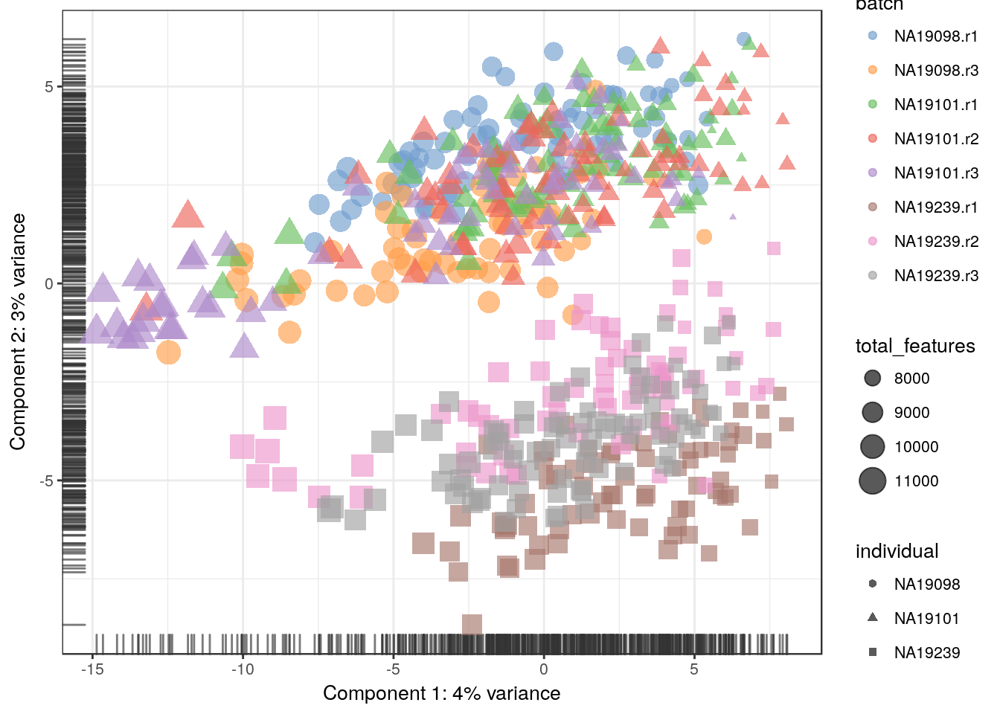
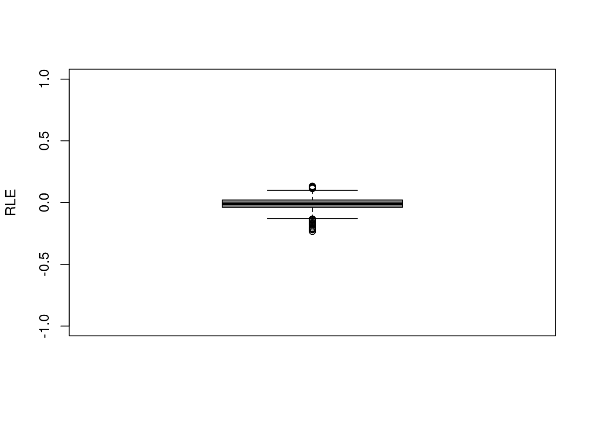
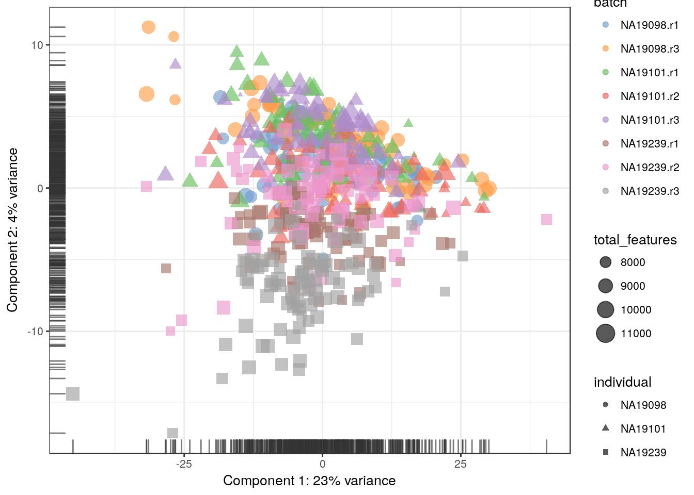

# Normalization for library size (Reads)

(\#fig:norm-pca-raw-reads)PCA plot of the blischak data

(\#fig:norm-ours-rle-raw-reads)Cell-wise RLE of the blischak data

(\#fig:norm-pca-cpm-reads)PCA plot of the blischak data after CPM normalisation

(\#fig:norm-ours-rle-cpm-reads)Cell-wise RLE of the blischak data

(\#fig:norm-pca-tmm-reads)PCA plot of the blischak data after TMM normalisation

(\#fig:norm-ours-rle-tmm-reads)Cell-wise RLE of the blischak data

(\#fig:norm-pca-lsf-umi)PCA plot of the blischak data after LSF normalisation

(\#fig:norm-ours-rle-scran-reads)Cell-wise RLE of the blischak data

(\#fig:norm-pca-rle-reads)PCA plot of the blischak data after RLE normalisation

(\#fig:norm-ours-rle-rle-reads)Cell-wise RLE of the blischak data

(\#fig:norm-pca-uq-reads)PCA plot of the blischak data after UQ normalisation

(\#fig:norm-ours-rle-uq-reads)Cell-wise RLE of the blischak data

(\#fig:norm-pca-downsample-reads)PCA plot of the blischak data after downsampling

(\#fig:norm-ours-rle-downsample-reads)Cell-wise RLE of the blischak data

(\#fig:norm-pca-fpkm-reads)PCA plot of the blischak data after FPKM normalisation

(\#fig:norm-pca-tpm-reads)PCA plot of the blischak data after TPM normalisation

