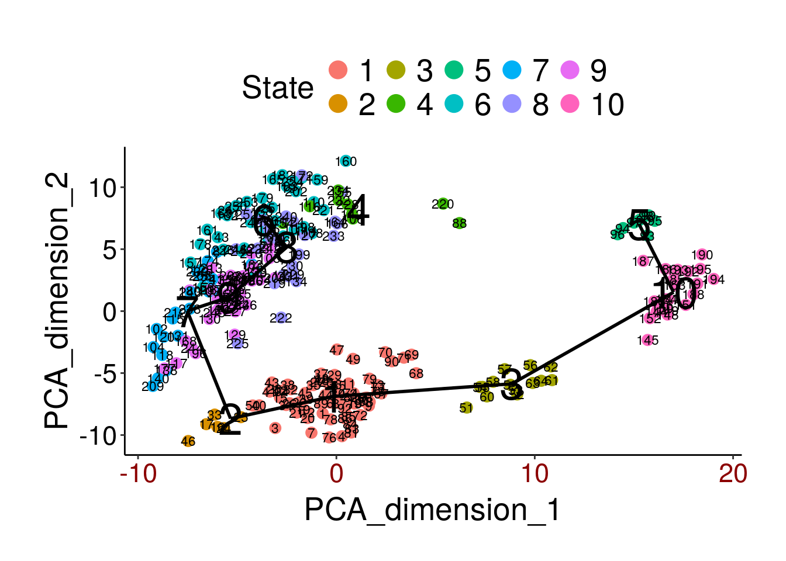
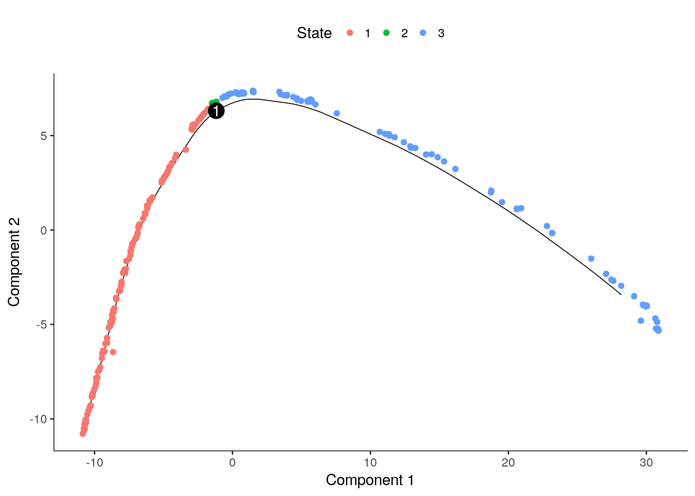
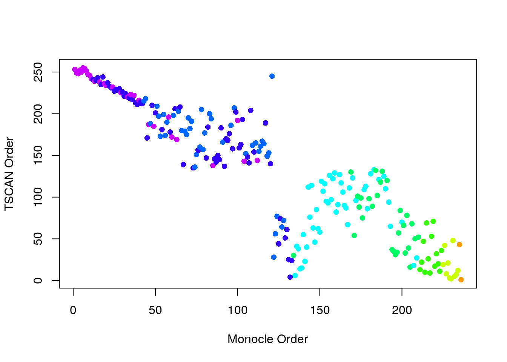
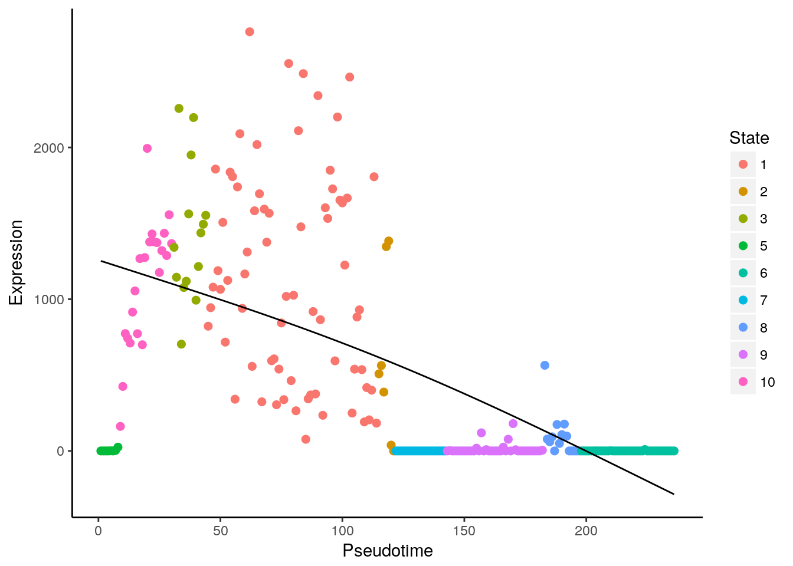

# Pseudotime analysis


```r
library(TSCAN)
library(M3Drop)
library(monocle)
library(destiny)
set.seed(1)
```

In many situations, one is studying a process where cells change
continuously. This includes for example many differentiation processes
taking place during development, where following a stimulus, cells
will change from one cell-type to another. Ideally, we would like to
monitor the expression levels of an individual cell over
time. Unfortunately, such monitoring is not possible with scRNA-seq
since the cell is lysed (destroyed) when the RNA is extracted.

Instead, we must sample at multiple time-points and obtain snapshots of
the gene expression profiles. Since some of the cells will
proceed faster along the differentiation than others, each snapshot may contain
cells at varying points along the developmental progression. We use statistical methods
 to order the cells along one or more trajectories which represent the underlying
 developmental trajectories, this ordering is referred to as "pseudotime".

In this chapter we will consider two different tools, Monocle and
TSCAN for ordering cells according to their pseudotime development. To
illustrate the methods we will be using a dataset on mouse embryonic
development [@Deng2014-mx]. The dataset consists of
268 cells from 10 different time-points of early mouse development.

## TSCAN

TSCAN combines clustering with pseudotime analysis. First it clusters the cells using `mclust`,
which is based on a mixture of normal distributions. Then it builds a minimum spanning tree to connect the clusters together. The branch of this tree that connects the largest number of clusters is the main branch which is used to determine pseudotime.

First we will try to use all genes to order the cells.

```r
deng <- readRDS("deng/deng.rds")
cellLabels <- colnames(deng)
procdeng <- TSCAN::preprocess(deng)
colnames(procdeng) <- 1:ncol(deng)
dengclust <- TSCAN::exprmclust(procdeng, clusternum = 10)
TSCAN::plotmclust(dengclust)
```



```r
dengorderTSCAN <- TSCAN::TSCANorder(dengclust, orderonly = F)
pseudotime_order_tscan <- as.character(dengorderTSCAN$sample_name)
```

We can also examine which timepoints have been assigned to each state:


```r
cellLabels[dengclust$clusterid == 10]
```

```
##  [1] "late2cell" "late2cell" "late2cell" "late2cell" "late2cell"
##  [6] "late2cell" "late2cell" "late2cell" "late2cell" "late2cell"
## [11] "mid2cell"  "mid2cell"  "mid2cell"  "mid2cell"  "mid2cell" 
## [16] "mid2cell"  "mid2cell"  "mid2cell"  "mid2cell"  "mid2cell" 
## [21] "mid2cell"  "mid2cell"
```

```r
colours <- rainbow(n = 10) # red = early, violet = late
tmp <-
    factor(
        cellLabels[as.numeric(pseudotime_order_tscan)],
        levels = c("early2cell", "mid2cell", "late2cell", "4cell", "8cell",
                   "16cell", "earlyblast", "midblast", "lateblast")
    )
plot(
    as.numeric(tmp),
    xlab = "Pseudotime Order",
    ylab = "Timepoint",
    col = colours[tmp],
    pch = 16
)
```


__Exercise 1__ Compare results for different numbers of clusters (`clusternum`).

## monocle

Monocle skips the clustering stage of TSCAN and directly builds a
minimum spanning tree on a reduced dimension representation of the
cells to connect all cells. Monocle then identifies the longest path
in this tree to determine pseudotime. If the data contains diverging
trajectories (i.e. one cell type differentiates into two different
cell-types), monocle can identify these. Each of the resulting forked paths is
defined as a separate cell state.

Unfortunately, Monocle does not work when all the genes are used, so
we must carry out feature selection. First, we use M3Drop:

```r
m3dGenes <- as.character(
    M3Drop::M3DropDifferentialExpression(deng)$Gene
)
```


```r
d <- deng[which(rownames(deng) %in% m3dGenes), ]
d <- d[!duplicated(rownames(d)), ]
```

Now run monocle:

```r
colnames(d) <- 1:ncol(d)
geneNames <- rownames(d)
rownames(d) <- 1:nrow(d)
pd <- data.frame(timepoint = cellLabels)
pd <- new("AnnotatedDataFrame", data=pd)
fd <- data.frame(gene = geneNames)
fd <- new("AnnotatedDataFrame", data=fd)

dCellData <- monocle::newCellDataSet(d, phenoData = pd, featureData = fd)
dCellData <- monocle::setOrderingFilter(dCellData, 1:length(m3dGenes))
dCellDataSet <- monocle::reduceDimension(dCellData, pseudo_expr = 1)
dCellDataSet <- monocle::orderCells(dCellDataSet, reverse = TRUE)
monocle::plot_cell_trajectory(dCellDataSet)
```



```r
# Store the ordering
pseudotime_monocle <-
    data.frame(
        Timepoint = phenoData(dCellDataSet)$timepoint,
        pseudotime = phenoData(dCellDataSet)$Pseudotime,
        State=phenoData(dCellDataSet)$State
    )
rownames(pseudotime_monocle) <- 1:ncol(d)
pseudotime_order_monocle <-
    rownames(pseudotime_monocle[order(pseudotime_monocle$pseudotime), ])
```

We can again compare the inferred pseudotime to the known sampling timepoints.

```r
monocle_time_point <- factor(
     pseudotime_monocle$Timepoint,
     levels = c("early2cell", "mid2cell", "late2cell", "4cell", "8cell",
                   "16cell", "earlyblast", "midblast", "lateblast")
)

plot(
    pseudotime_monocle$pseudotime,
    monocle_time_point,
    xlab = "Pseudotime",
    ylab = "Timepoint",
    col = colours[monocle_time_point],
    pch = 16
)
```


## Diffusion maps

[Diffusion maps](https://en.wikipedia.org/wiki/Diffusion_map) were introduced by [Ronald Coifman and Stephane Lafon](http://www.sciencedirect.com/science/article/pii/S1063520306000546). Briefly, the underlying idea is to assume that the data are samples from a diffusion process. The method infers the low-dimensional manifold by estimating the eigenvalues and eigenvectors for the diffusion operator related to the data.

[Haghverdi et al](http://biorxiv.org/content/biorxiv/early/2015/08/04/023309.full.pdf) have applied the diffusion maps concept to the analysis of single-cell RNA-seq data to create an R package called [destiny](http://bioconductor.org/packages/destiny).


```r
dm <- DiffusionMap(t(log2(1+deng)))
tmp <- factor(
    colnames(deng),
    levels = c(
        "early2cell",
        "mid2cell",
        "late2cell",
        "4cell",
        "8cell",
        "16cell",
        "earlyblast",
        "midblast",
        "lateblast"
    )
)
plot(
    eigenvectors(dm)[,1],
    eigenvectors(dm)[,2],
    xlab="Diffusion component 1",
    ylab="Diffusion component 2",
    col = colours[tmp],
    pch = 16
)
```


Like the other methods, destiny does a good job at ordering the early time-points, but it is unable to distinguish the later ones.

__Exercise 2__ Do you get a better resolution between the later time points by considering additional eigenvectors?

__Exercise 3__ How does the ordering change if you only use the genes identified by M3Drop?

## Comparison of the methods

How do the trajectories inferred by TSCAN and Monocle compare?

```r
matched_ordering <-
    match(
        pseudotime_order_tscan,
        pseudotime_order_monocle
    )
timepoint_ordered <-
    monocle_time_point[order(pseudotime_monocle$pseudotime)]
plot(
    matched_ordering,
    xlab = "Monocle Order",
    ylab = "TSCAN Order",
    col = colours[timepoint_ordered],
    pch = 16
)
```



__Exercise 4__ Compare destiny to TSCAN and Monocle.

## Expression of genes through time
Each package also enables the visualization of expression through pseudotime.

__TSCAN__

```r
colnames(deng) <- 1:ncol(deng)
TSCAN::singlegeneplot(
    deng[rownames(deng) == "Obox6", ],
    dengorderTSCAN
)
```



__Monocle__

```r
monocle::plot_genes_in_pseudotime(
    dCellDataSet[fData(dCellDataSet)$gene == "Obox6",],
    color_by = "timepoint"
)
```


Of course, pseudotime values computed with any method can be added to
the `pData` slot of an `SCESet` object. Having done that, the full
plotting capabilities of the `scater` package can be used to
investigate relationships between gene expression, cell populations
and pseudotime.

__Exercise 5__: Repeat the exercise using a subset of the genes, e.g. the set of highly variable genes that can be obtained using M3Drop::Brennecke_getVariableGenes
